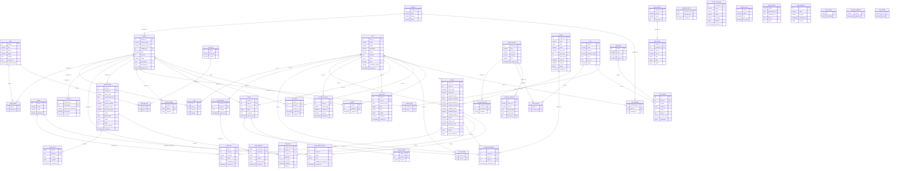

# Entity relationship diagram

Generated by `php bin/make_erd.php`.

```mermaid
erDiagram
    orders ||--o{ bank_slip : "order_id"
    admin ||--o{ bank_slip : "reviewed_by"
    product_batch ||--o{ batch_scan : "batch_id"
    blog ||--o{ blog_product : "blog_id"
    product ||--o{ blog_product : "product_id"
    blog ||--o{ blog_tag_map : "blog_id"
    blog_tag ||--o{ blog_tag_map : "tag_id"
    product ||--o{ cart : "product_id"
    user ||--o{ cart : "user_id"
    chat_session ||--o{ chat_message : "session_id"
    user ||--o{ chat_session : "user_id"
    health_concern ||--o{ concern_keyword : "concern_id"
    coupon ||--o{ coupon_redemption : "coupon_id"
    orders ||--o{ coupon_redemption : "order_id"
    user ||--o{ coupon_redemption : "user_id"
    product ||--o{ discount : "product_id"
    health_concern ||--o{ herb_concern : "concern_id"
    herb ||--o{ herb_concern : "herb_id"
    safety_flag ||--o{ herb_safety : "flag_id"
    herb ||--o{ herb_safety : "herb_id"
    product_batch ||--o{ order_item : "batch_id"
    orders ||--o{ order_item : "order_id"
    product ||--o{ order_item : "product_id"
    admin ||--o{ order_status_history : "changed_by_admin_id"
    orders ||--o{ order_status_history : "order_id"
    coupon ||--o{ orders : "coupon_id"
    user ||--o{ orders : "user_id"
    user ||--o{ password_resets : "user_id"
    category ||--o{ product : "category_id"
    product ||--o{ product_batch : "product_id"
    product ||--o{ product_dosha : "product_id"
    herb ||--o{ product_herb : "herb_id"
    product ||--o{ product_herb : "product_id"
    quiz_question ||--o{ quiz_option : "question_id"
    user ||--o{ quiz_result : "user_id"
    product ||--o{ review : "product_id"
    user ||--o{ review : "user_id"
    review ||--o{ review_helpful : "review_id"
    user ||--o{ review_helpful : "user_id"
    review ||--o{ review_image : "review_id"
    health_concern ||--o{ seasonal_collection : "concern_id"
    product ||--o{ stock_alert : "product_id"
    user ||--o{ stock_alert : "user_id"
    category ||--o{ user_category : "category_id"
    user ||--o{ user_category : "user_id"
    product ||--o{ wishlist : "product_id"
    user ||--o{ wishlist : "user_id"
    admin {
        int admin_id PK
        varchar name
        varchar email
        varchar password
    }
    assistant_cache {
        char question_hash PK
        text answer_json
        timestamp created_at
    }
    bank_slip {
        int slip_id PK
        int order_id FK
        varchar file_path
        enum status
        int reviewed_by FK
        timestamp created_at
    }
    batch_scan {
        bigint scan_id PK
        int batch_id FK
        char ip_hash
        char ua_hash
        timestamp scanned_at
    }
    blog {
        int blog_id PK
        varchar title
        varchar title_si
        varchar image
        text content
        text content_si
        datetime published_date
    }
    blog_product {
        int blog_id PK
        int product_id PK
    }
    blog_tag {
        int tag_id PK
        varchar name_en
        varchar name_si
    }
    blog_tag_map {
        int blog_id PK
        int tag_id PK
    }
    cart {
        int cart_id PK
        int user_id FK
        int product_id FK
        int quantity
    }
    category {
        int category_id PK
        varchar name
        varchar name_si
        varchar image
    }
    chat_message {
        bigint message_id PK
        int session_id FK
        enum role
        text content
        tinyint weak_match
        timestamp created_at
    }
    chat_session {
        int session_id PK
        int user_id FK
        char ip_hash
        timestamp created_at
    }
    concern_keyword {
        int keyword_id PK
        int concern_id FK
        varchar keyword
    }
    contact_message {
        int message_id PK
        varchar name
        varchar email
        varchar subject
        varchar message
        tinyint handled
        timestamp created_at
    }
    coupon {
        int coupon_id PK
        varchar code
        enum type
        decimal value
        decimal min_order
        int max_uses
        int used_count
        datetime starts_at
        datetime ends_at
        tinyint active
        timestamp created_at
    }
    coupon_redemption {
        int id PK
        int coupon_id FK
        int user_id FK
        int order_id FK
        timestamp redeemed_at
    }
    delivery_zone {
        int zone_id PK
        varchar district
        decimal fee
        decimal free_over
    }
    discount {
        int discount_id PK
        int product_id FK
        decimal discount_percentage
        datetime start_date
        datetime end_date
    }
    dosha_profile {
        enum dosha PK
        text description_en
        text description_si
        text tips_en
        text tips_si
    }
    health_concern {
        int concern_id PK
        varchar slug
        varchar name_en
        varchar name_si
        varchar icon
        timestamp created_at
    }
    herb {
        int herb_id PK
        varchar name
        varchar name_si
        varchar scientific_name
        text uses
        text uses_si
        varchar image
    }
    herb_concern {
        int herb_id PK
        int concern_id PK
    }
    herb_safety {
        int id PK
        int herb_id FK
        int flag_id FK
        enum severity
        text note_en
        text note_si
        varchar source_note
        tinyint published
    }
    login_attempts {
        int id PK
        varchar email
        varchar ip_hash
        timestamp attempted_at
        tinyint success
    }
    order_item {
        int order_item_id PK
        int order_id FK
        int product_id FK
        int quantity
        decimal unit_price
        decimal subtotal
        int batch_id FK
    }
    order_status_history {
        int id PK
        int order_id FK
        enum status
        varchar note
        int changed_by_admin_id FK
        timestamp created_at
    }
    orders {
        int order_id PK
        int user_id FK
        datetime order_date
        decimal total_price
        enum payment_status
        enum payment_method
        varchar stripe_session_id
        varchar payment_reference
        varchar shipping_name
        varchar shipping_phone
        text shipping_address
        varchar district
        decimal delivery_fee
        decimal discount_total
        int coupon_id FK
        enum status
        tinyint stock_deducted
    }
    password_resets {
        int id PK
        int user_id FK
        varchar token_hash
        datetime expires_at
        datetime used_at
        timestamp created_at
    }
    product {
        int product_id PK
        varchar product_name
        varchar product_name_si
        int category_id FK
        decimal price
        int quantity
        varchar image
        text description
        text description_si
        decimal original_price
    }
    product_batch {
        int batch_id PK
        int product_id FK
        varchar batch_code
        date manufactured_on
        date expires_on
        varchar source_location
        varchar supplier_name
        varchar lab_report_path
        text notes
        char public_token
        enum status
        int units
        int units_allocated
        timestamp created_at
    }
    product_dosha {
        int product_id PK
        enum dosha PK
        tinyint strength
    }
    product_herb {
        int product_id PK
        int herb_id PK
    }
    quiz_option {
        int option_id PK
        int question_id FK
        varchar text_en
        varchar text_si
        tinyint vata
        tinyint pitta
        tinyint kapha
    }
    quiz_question {
        int question_id PK
        varchar text_en
        varchar text_si
        int sort_order
    }
    quiz_result {
        int result_id PK
        int user_id FK
        char session_token
        tinyint vata
        tinyint pitta
        tinyint kapha
        varchar dominant
        timestamp created_at
    }
    quiz_setting {
        tinyint id PK
        tinyint published
    }
    review {
        int review_id PK
        int user_id FK
        int product_id FK
        tinyint rating
        text comment
        datetime review_date
    }
    review_helpful {
        int review_id PK
        int user_id PK
    }
    review_image {
        int image_id PK
        int review_id FK
        varchar file_path
    }
    safety_flag {
        int flag_id PK
        varchar code
        varchar name_en
        varchar name_si
    }
    schema_migrations {
        varchar version PK
        timestamp applied_at
    }
    seasonal_collection {
        int id PK
        varchar name_en
        varchar name_si
        char start_mmdd
        char end_mmdd
        int concern_id FK
    }
    site_setting {
        varchar name PK
        varchar value
    }
    stock_alert {
        int alert_id PK
        int user_id FK
        int product_id FK
        timestamp created_at
        datetime notified_at
    }
    user {
        int user_id PK
        varchar name
        varchar email
        varchar password
        varchar phone
        text address
        enum status
        varchar lang
        varchar verification_token
        timestamp created_at
    }
    user_category {
        int userCategory_id PK
        int user_id FK
        int category_id FK
    }
    wishlist {
        int user_id PK
        int product_id PK
        timestamp created_at
    }
```
